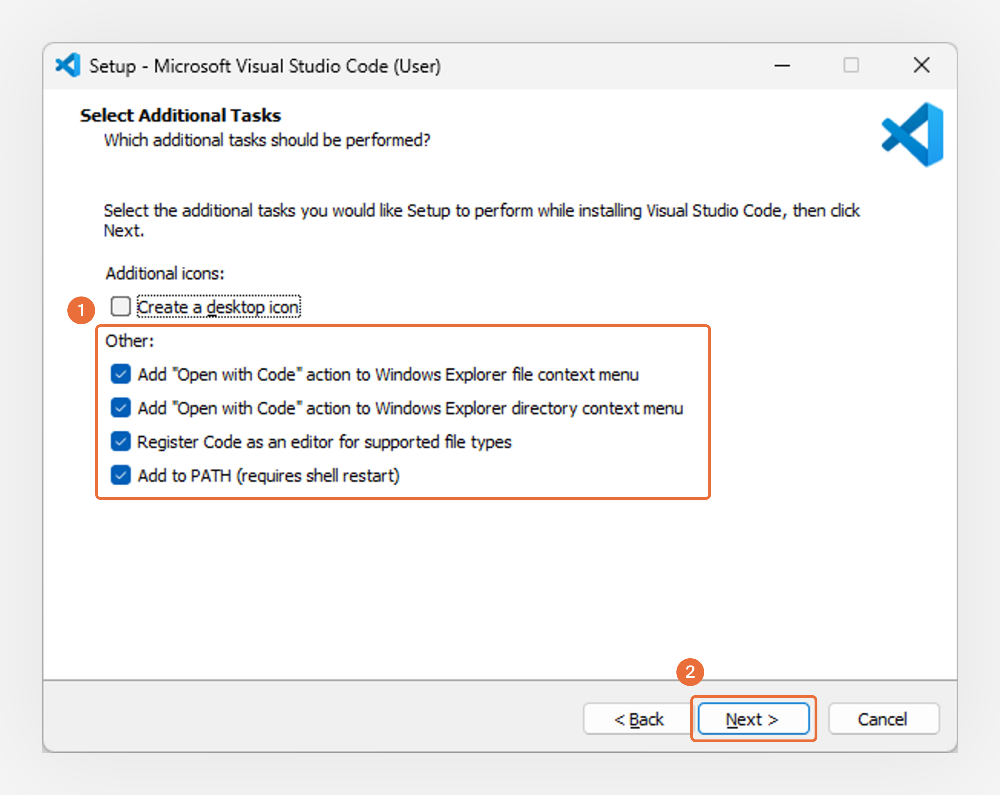
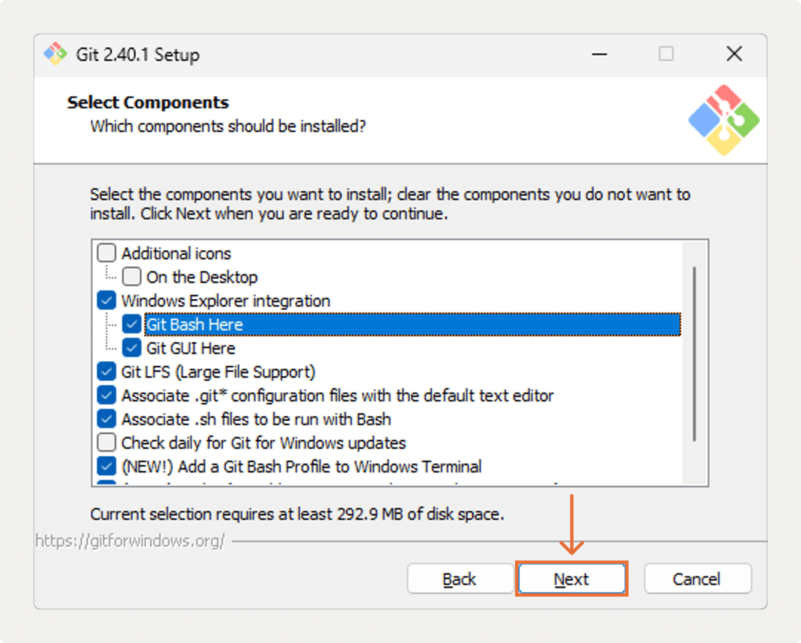
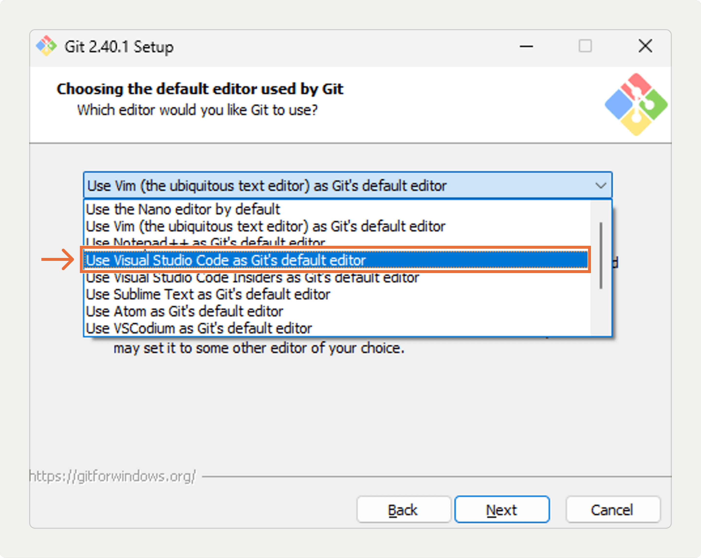
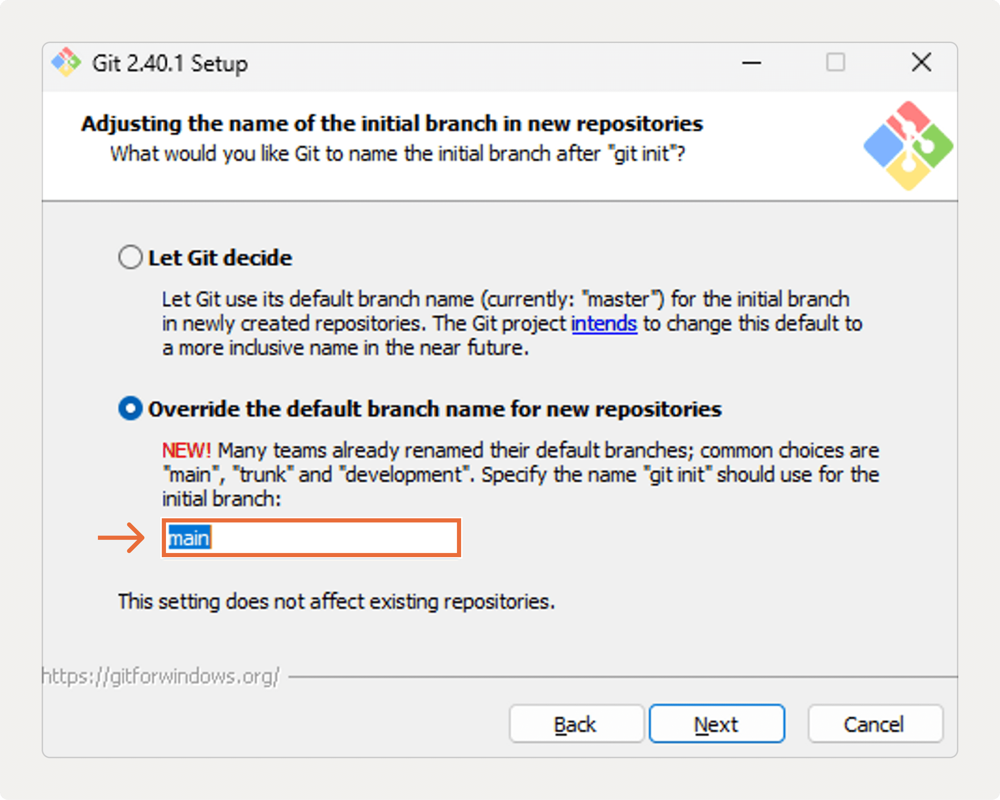

# **Installing VS Code and Git Bash**

## VS Code

- [Download](https://code.visualstudio.com/download)

<figure>
    
    <figcaption>Make sure to select all options under "other"</figcaption>
</figure>

- [A video explaining how to use it](https://www.youtube.com/watch?v=q6j-glH0bz4&t=98s)

## Git Bash

- [Download](https://git-scm.com/download/win)

<figure>
    
    <figcaption>Choose default options and hit "next" until you get to this screen</figcaption>
</figure>

- Most options can be left as default, but make sure you select the option to install Git Bash.
- Also select "Add a Git Bash profile to Windows Terminal"

<figure>
    
    <figcaption>When you get to this screen, make VS Code the default editor!</figcaption>
</figure>

<figure>
    
    <figcaption>On this screen, override default branch and call it main</figcaption>
</figure>

- Select default options for rest of install.